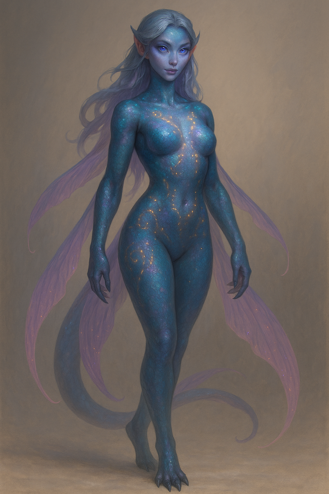

# 포획도감 기록 — 쇼탈라슈 (Shotalashu)

---

- 기본 정보
  * **분류**:
  
  
  
  * **발견 장소**: 코르토스 섬 리븐 힐즈, 원산지 카스트로벨
  * **위협 등급**: 중급
  * **교배 적합도**: 중간

---

- 외형 기록
  * **원본**:  
  네 발로 달리는 대형 파충류형 짐승. 보석빛 비늘이 청록·보라·남보석빛으로 번쩍이며, 감정 단위의 텔레파시를 발산한다.  
  라슌타 전사의 전통 마운트로 알려져 있으며, 신뢰를 얻기 전에는 결코 다른 이를 태우지 않는다.  

  * **교배 Graft Ver.**:  
  이족보행 여성형으로 변형된 하이브리드. 매끈한 비늘과 발광 문양이 몸을 장식하며, 팔과 꼬리에는 반투명 지느러미가 드리워진다.  
  은빛 속눈썹 아래의 크고 빛나는 눈은 지성과 따스한 감정을 담아내며, 인간적인 곡선을 띤 체형으로 “교배 가능” 조건을 충족한다.  

---

- 교배 실험
  * **교배 방식**: 텔레파시적 유대 형성 이후 교미 가능. 의식적으로 신뢰를 쌓아야만 접근을 허용.  
  * **특이 반응**: 교배 중 은은한 발광 문양이 맥동하며 감정 파동이 주위에 전해짐.  
  * **예상 후대 특성**: 공감 능력 강화, 발광 패턴 유전 가능성 높음.  
  * **슬라몬 주석**: *“의무감만으로는 안 되더군… 하지만 눈빛을 보고 있자니, 이상하게 손이 떨렸다.”*  

---

- 스케치
>
